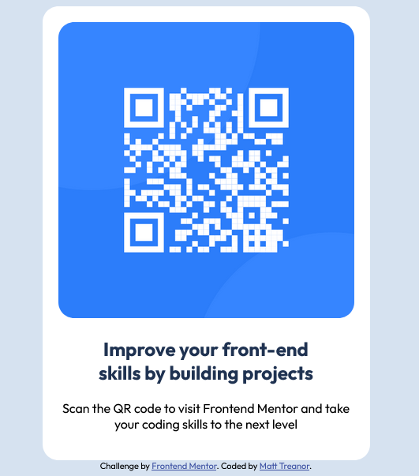

# QR-code-component-
Frontend Mentor challenge 
# Frontend Mentor - QR code component solution

## Overview

Hi everyone, my name is Matt. I'm trying to self-study Web development at home in my free time, at this point in time I'm only a few months into my journey. I'm really enjoying it all. Hoping to make a career out of it.

### Screenshot

### Built with

- Semantic HTML5 markup
- CSS custom properties

### What I learned

This challenge was a big eye opener for me at how I can over complicated something quite simple. By going back over my notes, using the information given to assist in the completion of this task and re-evaluating what I have learned. It was a little refreshing to see that I didn't need to use flex/grid to complete this challenge, alot of the projects I have completed required me to use these so it's good to see the basic display method again.
I cannot wait to try other challenged with Frontend mentor as it is a massive comfidence boost in my abilites so far, even if it is very basic. This challenge took me about 45 minutes to an hour to complete.
